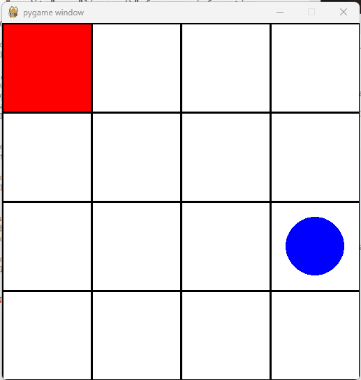
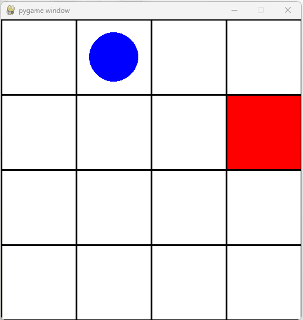

# Drone Navigation Environment
The Drone Navigation environment is a custom implementation using the OpenAI Gym toolkit, designed for developing and comparing reinforcement learning algorithms in a navigation scenario. The environment simulates a drone navigating a grid to reach a specified target while avoiding penalties.

## Features
### **Custom Gym Environment** 
Fully conforms to the Gym interface.

### **Configurable Parameters** 
Size of the **`grid`**, the **`start position`**, and the **`maximum number of steps`** are configurable.

### **Observation and Action Space**
* **Observation Space** Includes the drone's current position.
* **Action Space:** Allows the drone to move up, down, left, or right.

### **Reward Function** 
Rewards for reaching the target and penalties for unnecessary movements or boundary violations.

### **Visualization** 
Rendering functionality to visualize the drone's movements within the environment.

## Environment Setup
### Dependencies
* Python (3.8+)
* gym (0.26.0)
* numpy (1.23.5)
* pygame (2.1.0)
* tensorflow (2.12.0)
* keras (2.12.0)
* keras-rl2 (1.0.5)

### Installation
Ensure all dependencies are installed using pip:
```
pip install gym==0.26.0 numpy==1.23.5 pygame==2.1.0 tensorflow==2.12.0 keras-rl2==1.0.5
```

### Build & Install package 
Build and install the **`task-rl`** package by running the following command 
```
python -m venv .env
pip install -e .
```

### Example Run 
To run a simple simulation where the drone executes random moves, execute the provided Python script `run_task_rl.py`:
```
python run_task_rl.py
```

Upon running this script, you will be presented with a menu that allows you to choose from several actions:
1. **Execute a Random Navigation Strategy:** The drone will navigate through the environment using randomly selected moves.
2. **Execute a Pre-Trained DQN (Deep Q-Network) Navigation Strategy:** Utilize a trained model to navigate the drone efficiently towards the target.
3. **Train a DQN Navigation Agent:** Train a new model within the environment to improve the drone's navigation capabilities.
4. **Exit:** Close the program and the environment.

## Usage
To use the Drone Navigation environment, follow these steps:
1. Import the environment:
```
import gym
import task_rl
```
2. Create an instance of the environment with custom parameters:
```
env = gym.make('task_rl/DroneNavigation-v0', render_mode="human", size=4, start_position=(1,1), max_steps=100)
```
3. Interact with the environment using typical Gym methods (**`reset()`**, **`step()`**, **`render()`**, etc.).
4. Here is an example of how to run a simple simulation with the drone executing random moves:
```
observation = env.reset()
done = False
score = 0
while not done:
    action = env.action_space.sample()
    observation, reward, done, info = env.step(action)
    score += reward 
    print(f"Step: {reward}, Score: {score}")
```

### Deep Q-Network Integration
The **`DroneNavigation`** environment is compatible with advanced reinforcement learning techniques, such as Deep Q-Networks (DQN). The project includes an example of training a DQN agent to navigate the drone optimally using TensorFlow and Keras.

* **Model Configuration:** Includes layers setup and DQN agent configuration.
  ```
  model = Sequential()
    model.add(Flatten(input_shape=(1, 4)))
    model.add(Dense(24, activation="relu"))
    model.add(Dense(24, activation="relu"))
    model.add(Dense(actions, activation="linear"))

    agent = DQNAgent(
        model=model,
        processor=CustomProcessor(),
        memory=SequentialMemory(limit=50000, window_length=1),
        policy=BoltzmannQPolicy(),
        nb_actions=actions,
        nb_steps_warmup=10,
        target_model_update=0.01
    )

    agent.compile(Adam(lr=1e-3), metrics=["mae"])
  ```
* **Training and Testing:** Functions to train the DQN agent and evaluate its performance in the environment.
  ```
  agent.fit(env, nb_steps=50000, visualize=False, verbose=1)
  agent.save_weights('drone_navigation_weights.h5f', overwrite=True)
  results = agent.test(env, nb_episodes=episodes, visualize=True, verbose=0)
  print(results.history)
  ```

## Results
This section details the observed outcomes from the Drone Navigation environment using two distinct strategies: a random move strategy and a trained DQN (Deep Q-Network) agent.

### Random Move Strategy
When deploying the random move strategy, the drone's movements were uncoordinated and non-strategic. The drone navigated the environment with randomly selected moves, which often resulted in inefficient paths, frequent boundary collisions, and unnecessary steps. This approach served as a baseline to highlight the natural variability and inefficiency of non-guided exploration.



### Trained DQN Agent
In contrast, using a trained DQN agent drastically changed the drone's navigation behavior. The DQN agent consistently utilized optimal paths to reach the target. This strategy demonstrated a clear understanding of the environment's dynamics, as the agent made precise and calculated moves. The efficiency of this approach was evident in the reduced number of steps to reach the target and the maximization of the reward function.



The comparative analysis between these two strategies highlights the effectiveness of reinforcement learning in navigating complex environments. The DQN agent's ability to learn and apply optimal navigation strategies starkly contrasts with the random, aimless movements of the baseline approach, showcasing the potential of advanced AI techniques in real-world applications.


## Credits
Author: **Marius Peicu**

## License
This project is licensed under the MIT License - see the LICENSE file for details.
